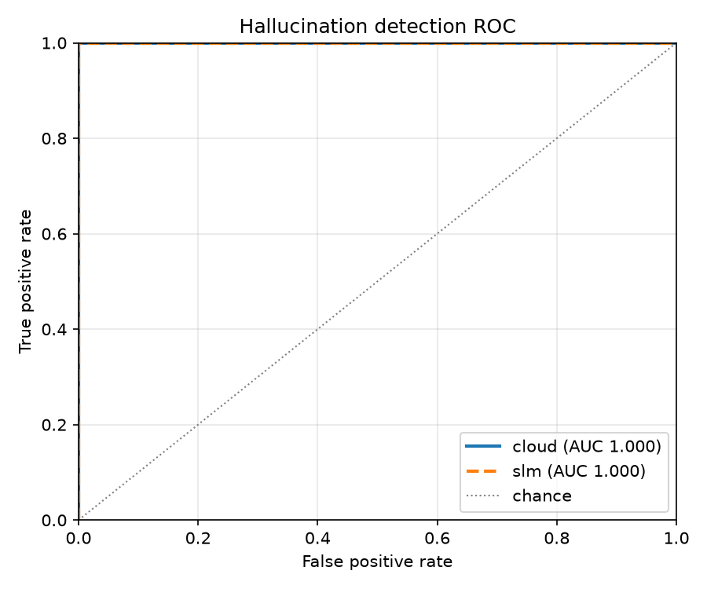
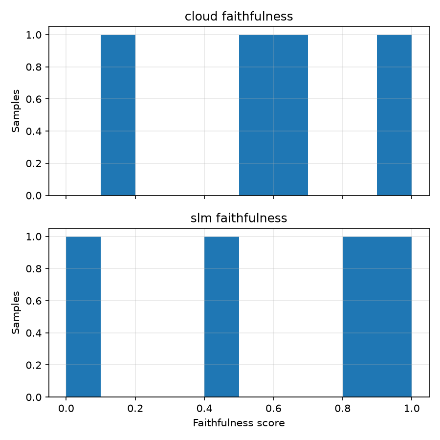
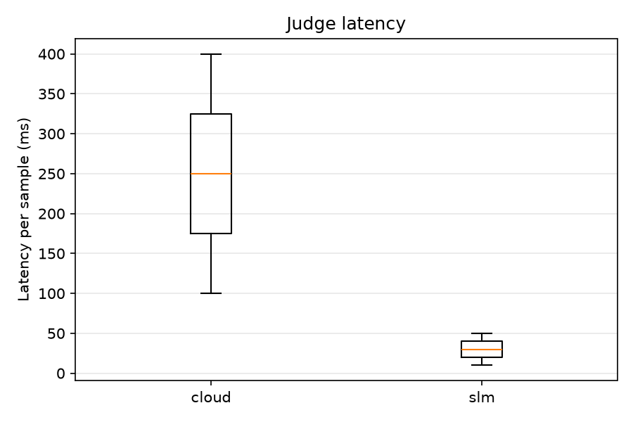

# Benchmark summary

Datasets: synthbench · rows: 9 · judges: cloud, slm

Predicted hallucinated when `faithfulness < threshold`. Rows the judge could not score are reported as *unscored* and excluded from every threshold metric.

## Detection quality at the best-F1 threshold

| Judge | Model | Scored | Unscored | Best t | P | R | F1 | BA | ROC-AUC |
|---|---|---|---|---|---|---|---|---|---|
| cloud | synthetic-cloud | 4 | 0 | 0.55 | 1.000 | 1.000 | 1.000 | 1.000 | 1.000 |
| slm | synthetic-slm | 4 | 1 | 0.45 | 1.000 | 1.000 | 1.000 | 1.000 | 1.000 |

### cloud: threshold sweep

| t | TP | FP | FN | TN | P | R | F1 | BA |
|---|---|---|---|---|---|---|---|---|
| 0.00 | 0 | 0 | 2 | 2 | 0.000 | 0.000 | 0.000 | 0.500 |
| 0.05 | 0 | 0 | 2 | 2 | 0.000 | 0.000 | 0.000 | 0.500 |
| 0.10 | 0 | 0 | 2 | 2 | 0.000 | 0.000 | 0.000 | 0.500 |
| 0.15 | 1 | 0 | 1 | 2 | 1.000 | 0.500 | 0.667 | 0.750 |
| 0.20 | 1 | 0 | 1 | 2 | 1.000 | 0.500 | 0.667 | 0.750 |
| 0.25 | 1 | 0 | 1 | 2 | 1.000 | 0.500 | 0.667 | 0.750 |
| 0.30 | 1 | 0 | 1 | 2 | 1.000 | 0.500 | 0.667 | 0.750 |
| 0.35 | 1 | 0 | 1 | 2 | 1.000 | 0.500 | 0.667 | 0.750 |
| 0.40 | 1 | 0 | 1 | 2 | 1.000 | 0.500 | 0.667 | 0.750 |
| 0.45 | 1 | 0 | 1 | 2 | 1.000 | 0.500 | 0.667 | 0.750 |
| 0.50 | 1 | 0 | 1 | 2 | 1.000 | 0.500 | 0.667 | 0.750 |
| 0.55 | 2 | 0 | 0 | 2 | 1.000 | 1.000 | 1.000 | 1.000 |
| 0.60 | 2 | 0 | 0 | 2 | 1.000 | 1.000 | 1.000 | 1.000 |
| 0.65 | 2 | 0 | 0 | 2 | 1.000 | 1.000 | 1.000 | 1.000 |
| 0.70 | 2 | 0 | 0 | 2 | 1.000 | 1.000 | 1.000 | 1.000 |
| 0.75 | 2 | 1 | 0 | 1 | 0.667 | 1.000 | 0.800 | 0.750 |
| 0.80 | 2 | 1 | 0 | 1 | 0.667 | 1.000 | 0.800 | 0.750 |
| 0.85 | 2 | 1 | 0 | 1 | 0.667 | 1.000 | 0.800 | 0.750 |
| 0.90 | 2 | 1 | 0 | 1 | 0.667 | 1.000 | 0.800 | 0.750 |
| 0.95 | 2 | 2 | 0 | 0 | 0.500 | 1.000 | 0.667 | 0.500 |
| 1.00 | 2 | 2 | 0 | 0 | 0.500 | 1.000 | 0.667 | 0.500 |

### slm: threshold sweep

| t | TP | FP | FN | TN | P | R | F1 | BA |
|---|---|---|---|---|---|---|---|---|
| 0.00 | 0 | 0 | 2 | 2 | 0.000 | 0.000 | 0.000 | 0.500 |
| 0.05 | 1 | 0 | 1 | 2 | 1.000 | 0.500 | 0.667 | 0.750 |
| 0.10 | 1 | 0 | 1 | 2 | 1.000 | 0.500 | 0.667 | 0.750 |
| 0.15 | 1 | 0 | 1 | 2 | 1.000 | 0.500 | 0.667 | 0.750 |
| 0.20 | 1 | 0 | 1 | 2 | 1.000 | 0.500 | 0.667 | 0.750 |
| 0.25 | 1 | 0 | 1 | 2 | 1.000 | 0.500 | 0.667 | 0.750 |
| 0.30 | 1 | 0 | 1 | 2 | 1.000 | 0.500 | 0.667 | 0.750 |
| 0.35 | 1 | 0 | 1 | 2 | 1.000 | 0.500 | 0.667 | 0.750 |
| 0.40 | 1 | 0 | 1 | 2 | 1.000 | 0.500 | 0.667 | 0.750 |
| 0.45 | 2 | 0 | 0 | 2 | 1.000 | 1.000 | 1.000 | 1.000 |
| 0.50 | 2 | 0 | 0 | 2 | 1.000 | 1.000 | 1.000 | 1.000 |
| 0.55 | 2 | 0 | 0 | 2 | 1.000 | 1.000 | 1.000 | 1.000 |
| 0.60 | 2 | 0 | 0 | 2 | 1.000 | 1.000 | 1.000 | 1.000 |
| 0.65 | 2 | 0 | 0 | 2 | 1.000 | 1.000 | 1.000 | 1.000 |
| 0.70 | 2 | 0 | 0 | 2 | 1.000 | 1.000 | 1.000 | 1.000 |
| 0.75 | 2 | 0 | 0 | 2 | 1.000 | 1.000 | 1.000 | 1.000 |
| 0.80 | 2 | 0 | 0 | 2 | 1.000 | 1.000 | 1.000 | 1.000 |
| 0.85 | 2 | 1 | 0 | 1 | 0.667 | 1.000 | 0.800 | 0.750 |
| 0.90 | 2 | 1 | 0 | 1 | 0.667 | 1.000 | 0.800 | 0.750 |
| 0.95 | 2 | 1 | 0 | 1 | 0.667 | 1.000 | 0.800 | 0.750 |
| 1.00 | 2 | 1 | 0 | 1 | 0.667 | 1.000 | 0.800 | 0.750 |

## Judge agreement

| Pair | Shared samples | Pearson | Spearman | Cohen's kappa |
|---|---|---|---|---|
| cloud vs slm | 4 | 0.990 | 1.000 | 1.000 |

Kappa compares the binary calls each judge makes at its **own** best-F1 threshold.

## Efficiency and cost

| Judge | Median latency (ms) | p95 latency (ms) | Mean tokens | Est. cost (USD) |
|---|---|---|---|---|
| cloud | 250.0 | 385.0 | 240.0 | 0.0064 |
| slm | 30.0 | 48.0 | 120.0 | 0.0000 |

Latency percentiles use linear interpolation between the two nearest samples. The local judge is reported at zero marginal cost: it bills no tokens, but it does occupy hardware you already pay for, so its true cost is amortized GPU/CPU time.

## Figures

